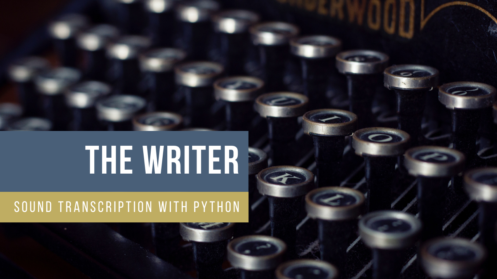
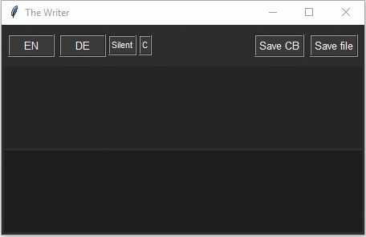
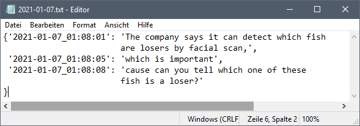

# The Writer

A Python UI application that transcribes speech output from your sound card. This can help if you are hearing impaired or just want to have a summary of your meeting.

# Features

* Transcribe from any spoken sounds. Either from your sound card or your own microphone (dictation mode).
* The app can transcribe from [dozens of languages](https://docs.microsoft.com/en-us/azure/cognitive-services/speech-service/language-support). Currently, English and German are implemented in the UI, but can be changed easily (2 lines of code).
* *Independent of any tool support.* 
* You can save your transcript (including time codes) to the clipboard or hard disk.

# Use Cases

* *See* what others are *saying* in an online conference.
* Helpful for the creation of the minutes of meeting (meeting protocol).
* Dictate text in any software (I find the native [Windows 10 speech recognition](https://support.microsoft.com/en-us/windows/use-dictation-to-talk-instead-of-type-on-your-pc-fec94565-c4bd-329d-e59a-af033fa5689f) very bad in comparison, tested this a few times).

**Further Ideas:**

* Create an A.I. which summarizes your text for proper minutes of meeting.
* Create an application that notifies you when your name is mentioned. In chase if you don't want to pay attention to a meeting properly (not recommended :slightly_smiling_face:).

# Demo

# Remarks
* The application uses the speech recognition service of the Microsoft Azure Cloud. If you don't have an account, the setup is quite easy. There is a free tier that allows you to process 5000 requests (sentences) for free per month. Beyond that, your requests will be throttled. (Taken 20 sentences per page, this would result in roughly 250 pages for free.)

* Like Alexa, Siri, and Google Assistant, the sound files are transferred to the cloud for further processing. If you don't want this, you can set up a private governance scenario with your [own VM and Docker containers](https://docs.microsoft.com/en-us/azure/cognitive-services/speech-service/speech-container-howto?tabs=stt%2Ccsharp%2Csimple-format). 

* You could also add a further speaker recognition (i.e. who said what). For privacy reasons, I did not include this feature.

# Installation

### 1. Cloud Setup

1. Create an [Azure cognitive speech resource](https://docs.microsoft.com/en-us/azure/cognitive-services/speech-service/get-started). Note the region where you created it, e.g. `West Europe`.
1. In the Azure portal, go to the created resource, click on `Keys and Endpoint` and note the API Key `KEY 1`.

### 2. Virtual Audio Cable Setup (optional)
The software [Virtual Audio Cable (VAC)](https://www.vb-audio.com/Cable/) provides access to your sound card stream. It basically creates a virtual microphone that is fed by the output of your sound card. You don't have to install it if you just want to use the dictation mode.

1. [Download](https://vb-audio.com/Cable/) the software. The basic version is free.
1. Setup the  software: [YouTube Configuration Manual](https://www.youtube.com/watch?v=ad30G5oBHtg&feature=emb_logo)
    * Under `Sound`, click on `Recording` and `Cable Output`.
    * Enable `Listen to this device` and select your standard playback device (i.e. sound channel)
    * This is the important step:   
  

### 3. Python Setup
1. Do a `pip install azure-cognitiveservices-speech`
1. Further required packages: `tkinter` and `pprint`

All done!

# Usage
* Call main.py with your noted service region and key:  
`python main.py -k SERVICE_KEY -r SERVICE_REGION `
* Optionally, you can directly specify which microphone to use. For this, you need to [retrieve your microphone hardware ID](https://docs.microsoft.com/en-us/azure/cognitive-services/speech-service/how-to-select-audio-input-devices) and give it as an input parameter: 
 
`python main.py -k SERVICE_KEY -r SERVICE_REGION -m {HW_ID} `
  
  
For Windows users, I precompiled the Microsoft example as a C# console app (see `get_microphone_id` folder).

-------

* Cick on `EN` or `DE` to start the recognition.
* The lower window shows the preliminary results, the upper window the final one (including punctuation).
* `Silent`: disables the UI text output (it is still recorded, though) 
* `Save CB`: copies all recorded text to the clip board
* `Save file`: saves all recorded text into a file in the applications folder.
* `C`: clears all recorded text from the memory.
* `Dict`: Enables dictation mode (it's rather a `punctuation mode`). With this active, phrases like "question mark" or "new line" will be replaced by their corresponding characters.

# Open Points

* Automatic language detection. Currently (02/2020) a once detected language is fixed, i.e. you cannot switch on the fly between two languages (this would be useful, though): [Documentation](https://docs.microsoft.com/en-us/azure/cognitive-services/speech-service/how-to-automatic-language-detection?pivots=programming-language-python).
* Create a routine to select a microphone (voice input). You have to [retrieve the microphone ID](https://docs.microsoft.com/en-us/azure/cognitive-services/speech-service/how-to-select-audio-input-devices) for this.
* Use proper Logging Framework.

# Contribution
Original photo by [Camille Orgel](https://unsplash.com/@cam_bam?utm_source=unsplash&amp;utm_medium=referral&amp;utm_content=creditCopyText) on Unsplash.